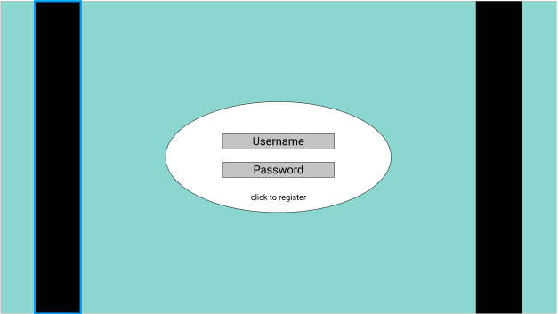
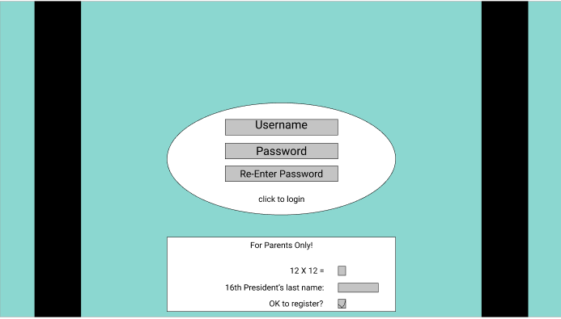
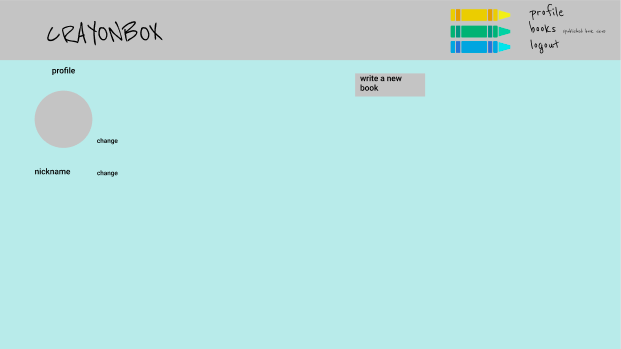
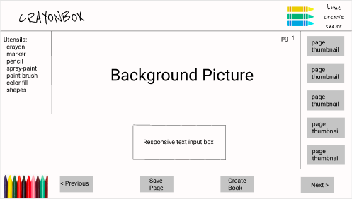
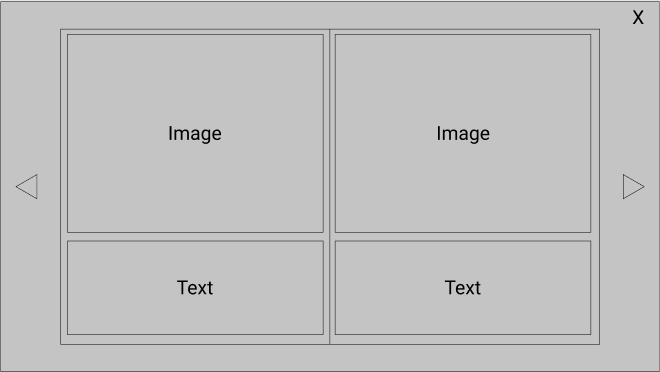
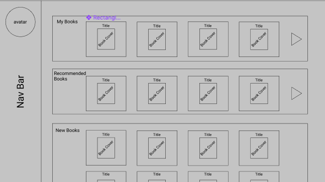
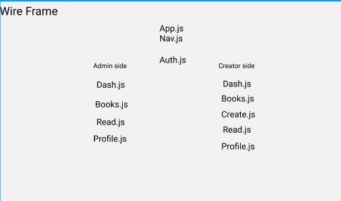

## Idea and Users
<ul>
  <li>Crayon-box is a bookshelf app for kids to keep them entertained at home during the pandemic by reading and creating their own books</li>
  <li>Crayon-box is directed towards children who enjoy art, and writing</li>
  <li>Children can safely design books without worrying about personal information or pictures being shared as each book is flitered by an Admin</li>
  <li>How to Use:</li>
  <ul>
    <li>Users will register for an account/login</li>
    <li>Users can update profile avatar(pre-set images)/author name</li>
    <li>Users can design pictures and text for each page of their books</li>
    <li>Users will be able to share their work, and look at books other users have created which have been approved by Admin</li>
    <li>Users can access published picture books that they can also enjoy</li>
  </ul>
</ul>

## Features
**MVP**

**Profile**
<ul>
  <li>Register</li>
  <li>Login</li>
  <li>Edit</li>
  <li>Delete</li>
</ul>

**Books**
<ul>
  <li>Create</li>
  <li>Edit</li>
  <li>Delete</li>
</ul>

**Paint tool**
<ul>
  <li>Create paint app for creating new books</li>
</ul>

**S3 Storage**
<ul>
  <li>For storing the images for the books</li>
</ul>

**icebox**
- ability to share books with other users
- invisible rating system that pushes popular books to the top of the list


## Database

Users
```SQL
create table users(
  user_id serial primary key,
  email text,
  password text,
  isAdmin boolean
)
```

Books
```SQL
create table books(
  book_id serial primary key,
  user_id int references users(user_id),
  admin_approval boolean,
  title text,
)
```

Pages
```SQL
create table pages(
  page_id serial primary key,
  book_id int references books(book_id)
  content text,
  image text
)
```
## View









## Server
**dependencies**
<ul>
  <li>express</li>
  <li>massive</li>
  <li>dotenv</li>
  <li>bcrypt</li>
  <li>sessions</li>
</ul>

**endpoints**

- User Accounts:
  - app.post('/user/register)
  - app.post('/user/login)
  - app.put('/user/admin)
  - app.delete('user/logout)

- Pages:
  - app.get('/pages')
  - app.post('/pages/add')
  - app.put('/pages/edit')
  - app.delete('/pages/delete')

- Book:
  - app.get('/books')
  - app.get('/book/:book_id')
  - app.delete('/books/delete')


**controllers**
```
USERS

POST ‘/user/register’
async
req.body = email, password
req.session.user =  {
userId
email 
{

POST ‘/user/login’
async
req.body = email, password
if authenticated -> set req.session

PUT '/user/admin'
async
req.params = user_id
toggle isAdmin -> true


DELETE ‘/user/logout’
req.session.destroy()
```
```
Pages

GET ‘/api/pages’
async
req.query = page_id
send pages

POST‘/api/add’
async
req.body = page_id, book_id, content, image
await -> insert
send pages

PUT‘/api/edit’
async
req.params = page_id
req.body = content, image
await -> edit
send pages

DELETE '/pages/delete'
req.params = page_id
req.body = content, image
```
```
Books

GET ‘/api/books’
async
req.query = user_id
send books

GET '/book/:book_id'
async
req.params = book_id
send book

DELETE

req.params =  book_id
req.body = title
```
## Client
**dependencies**
<ul>
  <li>axios</li>
  <li>redux/react-redux</li>
  <li>redux-dev-tools</li>
  <li>react-canvas-draw</li>
  <li>react-flip-page</li>
  <li>lz-string</li>
  <li>S3</li>
</ul>

**routes**
- Profile(/)
- Admin(/admin)
- Login(/login)
- Register(/register)
- AllBooks(/books)
- CreateBook(/create)
- ReadBook(/read)

**File Structure**
- src/
  - App.js /.css
  - index.js
  - redux/
    - store.js
    - userReducer.js
    - bookReducer.js
  - components/
   - Profile.js /.css
   - Login.js /.css
   - Register.js /.css
   - Admin.js /.css
   - CreateBook.js /.css
   - ReadBook.js /.css
   - Books.js /.css

